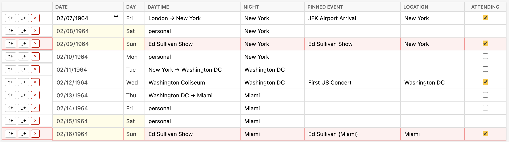

# Trip Tracker

A simple, offline-first tool for planning multi-city trips. Built for planning visits to companies, universities, conferences, or any itinerary where you need to track where you'll be each day and night.

The tracker highlights weekends so you don't inadvertently put work meetings there, but it won't prevent you from doing it; sometimes that's the only day that makes sense!



## What It Does

- **Day-by-day scheduling**: Track your daytime activities (organization visits, travel, personal time) and where you're staying each night
- **Pinned events**: Mark external events (conferences, deadlines) on specific dates and track whether you're attending
- **Constraint checking**: Automatically flags common planning mistakes:
  - Scheduling organization visits on weekends
  - Location changes without travel
  - Travel routes that don't connect properly
  - Attending events in cities where you're not staying
  - Mismatch between stated location and location of a pinned event (if specified)
- **Map visualization**: Generate an interactive map showing your travel route with geocoded locations
- **Data export/import**: Copy/paste your schedule as JSON (there is no other form of “saving”; save this file wherever you want)
- **Sharing**: “Print” non-pinned columns to both HTML and Markdown to share with others in email, files, etc.

## How to Use

1. Open `index.html` in a browser
2. Use the date column to set your trip's starting date (years 1900-2099 are supported; you can change this date, and also insert rows above/below as needed)
3. Fill in each day:
   - **Daytime**: Type an organization name, `personal`, or travel in the form `Boston -> NYC`, `Boston --> NYC`, `Boston → NYC`, or `Boston ⭢ NYC`
   - **Night**: Where you're staying that night
   - **Pinned Event/Location**: Optional external events to track
   - **Attending**: Check if you plan to attend a pinned event
4. Watch for constraint violations (highlighted in red) and fix as needed
5. Use **Map** to visualize your route
6. Use **Copy** to save your data, **Paste** to restore it later
7. Use **Print** to generate HTML and Markdown

### Keyboard Navigation

- **Tab/Enter** from Daytime moves to Night, then to the next row's Daytime
- **Arrow keys** navigate between rows within a column
- **Shift+Tab** moves backwards

## Running Locally

```bash
npm install
npm run build
# Open index.html in a browser
```

## Disclaimer

This is a personal project built for my own trip planning needs. It's provided as-is, with no guarantees. The geocoding feature uses OpenStreetMap's Nominatim service, which has usage limits. Your data stays entirely in your browser - nothing is sent to any server except geocoding requests to OpenStreetMap.
